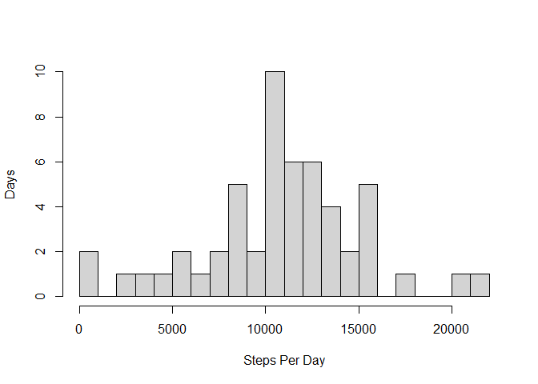
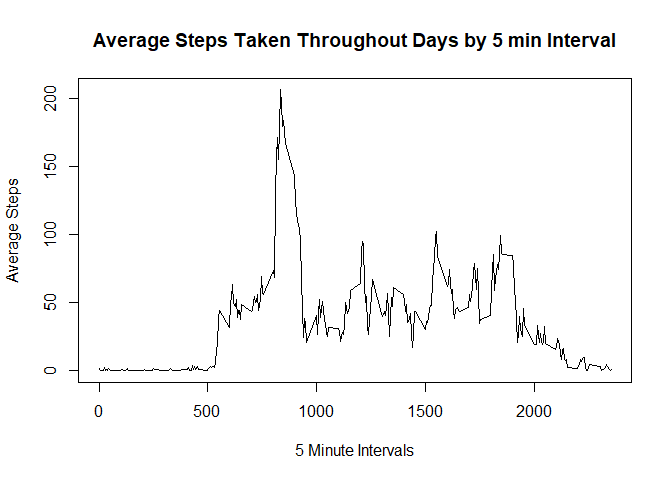
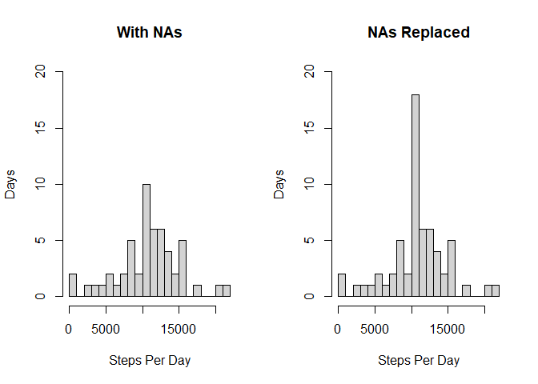
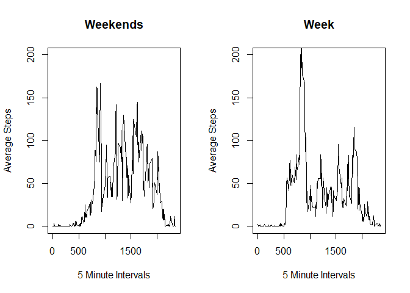

## Loading and preprocessing the data

```r
activity <- read.csv("activity.csv")
```

## What is mean total number of steps taken per day?


```r
StepsPerDay <- aggregate(steps ~ date,activity,sum)
print(paste("Mean: ", mean(StepsPerDay$steps)))
```

```
## [1] "Mean:  10766.1886792453"
```

```r
print(paste("Median steps per day: ",median(StepsPerDay$steps)))
```

```
## [1] "Median steps per day:  10765"
```

```r
hist(StepsPerDay$steps,breaks = 20,xlab="Steps Per Day",ylab="Days", main = "")
```

<!-- -->

## What is the average daily activity pattern?

```r
StepsPerInterval <- aggregate(steps ~ interval, activity,mean)
plot(StepsPerInterval$interval,StepsPerInterval$steps, xlab="5 Minute Intervals",ylab="Average Steps",type="l",main = "Average Steps Taken Throughout Days by 5 min Interval")
```

<!-- -->

```r
 maxInterval <- StepsPerInterval[StepsPerInterval$steps %in% max(StepsPerInterval$steps),]
 print(paste("Interval with the highest step count: ", maxInterval$interval))
```

```
## [1] "Interval with the highest step count:  835"
```
## Imputing missing values

**Number of NAs in step data:**

```r
print(paste("Number of NAs in step data: ",sum(is.na(activity$steps))))
```

```
## [1] "Number of NAs in step data:  2304"
```

**Replace NA values in Step data with average steps for that interval:**

```r
library(dplyr)
```

```
## 
## Attaching package: 'dplyr'
```

```
## The following objects are masked from 'package:stats':
## 
##     filter, lag
```

```
## The following objects are masked from 'package:base':
## 
##     intersect, setdiff, setequal, union
```

```r
noNa <- activity %>%  
  group_by(interval)%>% 
  mutate(steps=ifelse(is.na(steps),
                        as.integer(mean(steps,na.rm=TRUE)),
                        as.integer(steps)))

newStepsPerDay <- aggregate(steps ~ date,noNa,sum)
print(paste("New Mean: ", mean(newStepsPerDay$steps)))
```

```
## [1] "New Mean:  10749.7704918033"
```

```r
print(paste("OLD Mean: ", mean(StepsPerDay$steps)))
```

```
## [1] "OLD Mean:  10766.1886792453"
```

```r
print(paste("New Median: ",median(newStepsPerDay$steps)))
```

```
## [1] "New Median:  10641"
```

```r
print(paste("OLD Median: ",median(StepsPerDay$steps)))
```

```
## [1] "OLD Median:  10765"
```
**The new mean is higher while the median steps per day is lower**  
**Overall it is evident there is A LOT more data!**

```r
par(mfrow = c(1, 2)) 
hist(StepsPerDay$steps,breaks = 20,xlab="Steps Per Day",ylab="Days", main = "With NAs", ylim = c(0,20))
hist(newStepsPerDay$steps,breaks = 20,xlab="Steps Per Day",ylab="Days", main = "NAs Replaced", ylim = c(0,20))
```

<!-- -->

## Are there differences in activity patterns between weekdays and weekends?

```r
noNa$dayofweek <- weekdays(as.Date(noNa$date))
noNa$weekends <- as.factor(ifelse(noNa$dayofweek=='Saturday'|noNa$dayofweek=='Sunday',"weekend","weekday"))

w_end <- subset(noNa,weekends=='weekend',select = c("steps","interval"))
w_day<- subset(noNa,weekends=='weekday',select = c("steps","interval"))

w_end_spi <- aggregate(steps ~ interval, w_end,mean)
w_day_spi <- aggregate(steps ~ interval, w_day,mean)

par(mfrow = c(1, 2)) 
plot(w_end_spi$interval,w_end_spi$steps, xlab="5 Minute Intervals",ylab="Average Steps",type="l",main = "Weekends",ylim = c(0,200))
plot(w_day_spi$interval,w_day_spi$steps, xlab="5 Minute Intervals",ylab="Average Steps",type="l",main = "Week",ylim = c(0,200))
```

<!-- -->

**During the week steps are more varied probably due to schedule, with a spike at lunch and after work?  
whereas during the weekend steps are more spread out through the day**
